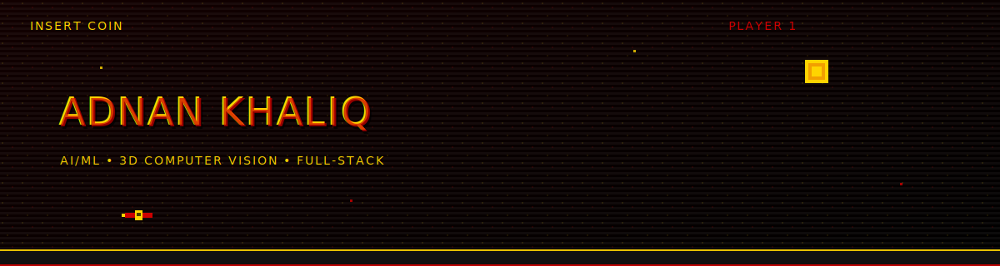

  

  <a href="https://www.linkedin.com/in/mianadnankhaliq">LinkedIn</a> ·
  <a href="mailto:adnankhaliq252@gmail.com">Email</a> ·
  <a href="https://github.com/Danimannnm">GitHub</a>

  

<h2 align="center">AI / ML ENGINEER</h2>

  <code>SOFTWARE ENGINEER</code>
  <code>AI</code>
  <code>PYTORCH</code>
  <code>POINT CLOUDS</code>
  <code>CLOUD ML</code>

  

## ABOUT

  

I build practical AI systems with a focus on computer vision and 3D point clouds.  
My work usually starts with messy datasets and ends with trained models, evaluated results, and usable demos.

I care about clean data pipelines, honest evaluation, and making model behavior visible through tooling and dashboards.

  

## TOP FOCUS

| AREA                     | WHAT I WORK ON                              | WHY IT MATTERS                       |
|--------------------------|---------------------------------------------|--------------------------------------|
| 3D Computer Vision       | Point clouds, segmentation, spatial learning | Real-world geometry is hard          |
| Applied Machine Learning | Training, evaluation, ML pipelines           | Models must generalize               |
| Industrial CV            | Detection, benchmarking, cloud ML platforms  | Production constraints matter        |
| Tooling & Visualization  | Dashboards, model inspection tools           | Visibility beats blind metrics       |
| Full-Stack Integration   | APIs, auth, cloud services, deployment       | Models need real users               |

  

## TOOLBOX
**ML / CV**  
PyTorch · TensorFlow/Keras · Image Processing · 3D Point Clouds  

**BACKEND / FULL-STACK**  
Node.js · Express · React · REST APIs  

**CLOUD / DEVOPS**  
Azure · AWS · basic GCP · Docker · Kubernetes · CI/CD exposure  

**DATABASES**  
MongoDB · MySQL · SQL Server  

  

  

## WHAT I’M LOOKING FOR
AI / ML internships or early-career roles focused on computer vision, 3D vision, or applied deep learning — teams where models touch real data and results actually matter.

  

## FEATURED PROJECTS

<b>[3D] POINT CLOUD SEGMENTATION</b>

> **WHAT IT DOES**  
> Prepares, segments, and relabels 3D point cloud data for deep learning workflows.

> **TECH STACK**  
> PyTorch · KPConv · CloudCompare · Python

> **WHY IT’S INTERESTING**  
> 3D data is noisy and sparse; preprocessing quality directly impacts training stability.

> **OUTCOME**  
> Reliable segmentation masks and improved consistency on complex spatial datasets.

  

<b>[CV] INDUSTRIAL OBJECT DETECTION — CLOUD BENCHMARKING</b>

> **WHAT IT DOES**  
> Evaluates cloud-based object detection platforms on the same industrial dataset.

> **TECH STACK**  
> Azure Custom Vision · Google Vertex AI · Roboflow · Python · Web dashboard

> **WHY IT’S INTERESTING**  
> Accuracy alone isn’t enough — training speed, dataset handling, and iteration cost matter.

> **OUTCOME**  
> Recommended Azure Custom Vision based on accuracy, efficiency, and operational fit.

  

<b>[ML] NEURAL FORECASTING PIPELINE</b>

> **WHAT IT DOES**  
> Forecasts next-day stock prices using neural models and time-aware evaluation.

> **TECH STACK**  
> Python · Neural Networks · Technical Indicators · Streamlit

> **WHY IT’S INTERESTING**  
> Most forecasting demos cheat — this pipeline avoids look-ahead bias.

> **OUTCOME**  
> Interactive dashboard comparing models, error metrics, and simple trading simulations.

  

<b>[FULL-STACK] PURRRFECT MATCH — MERN</b>

> **WHAT IT DOES**  
> Animal adoption platform with secure authentication and media handling.

> **TECH STACK**  
> MongoDB · Express · React · Node.js · OAuth · JWT · Cloudinary · PostMark

> **WHY IT’S INTERESTING**  
> Demonstrates end-to-end system design beyond isolated ML experiments.

> **OUTCOME**  
> Fully functional app with clean UX and production-style integrations.

  

## CONTACT ME
If you’re building in **Computer Vision**, **3D**, or **Applied ML**, I’m always down to talk — internships, collabs, or just swapping ideas.

  
  
  

  Mian Adnan Khaliq

